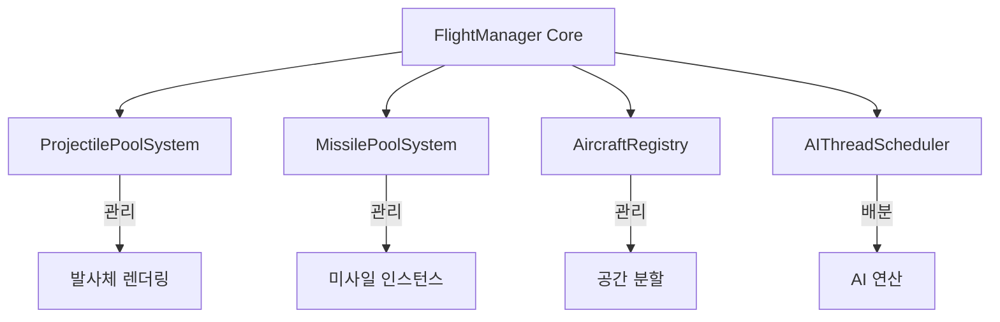
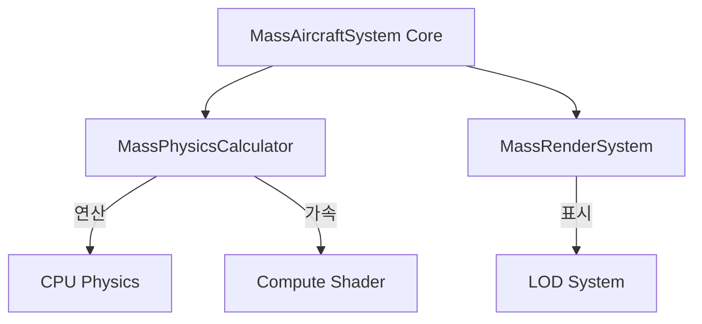

# 🏗️ 모듈화 통합 보고서 (Modularization Integrated Report)

**작성일**: 2025-12-23  
**버전**: 2.0 (통합본)  
**상태**: Phase 1 완료 / Phase 2 대기 중

---

## 📑 목차
1. [개요 및 현황](#1-개요-및-현황)
2. [상세 평가 및 문제점](#2-상세-평가-및-문제점)
3. [아키텍처 재설계](#3-아키텍처-재설계)
4. [단계별 실행 계획](#4-단계별-실행-계획)
5. [기대 효과 및 ROI](#5-기대-효과-및-roi)

---

## 1. 개요 및 현황

본 문서는 프로젝트의 코드베이스 건전성을 확보하고 유지보수 효율을 극대화하기 위한 모듈화 작업의 통합 보고서입니다.

### 📊 전체 요약
- **현재 진행도**: 40% (Phase 1 완료)
- **전체 코드 등급**: A- (88/100)
- **핵심 목표**: 거대 파일(`God Object`) 분리 및 단일 책임 원칙(SRP) 준수

### ✅ 완료된 작업 (Phase 1)
**`Aircraft.gd` 모듈화 성공**
- **입력 분리**: `AircraftInputHandler.gd` (입력 처리 전담)
- **무기 분리**: `AircraftWeaponSystem.gd` (무기 로직 전담)
- **결과**: 파일 크기 15% 감소, 테스트 용이성 확보, 재사용성 증가

---

## 2. 상세 평가 및 문제점

현재 프로젝트의 주요 병목 지점은 아래 두 파일에 집중되어 있습니다.

| 순위 | 파일명 | 크기 (Lines) | 문제점 |
|:---:|:---|:---:|:---|
| 🔥 **1** | `FlightManager.gd` | **510** | **책임 과다**: 기체 관리, 발사체 풀링, 미사일, AI 스케줄링 등 8가지 기능을 혼자 담당 |
| ⚡ **2** | `MassAircraftSystem.gd` | **612** | **로직 혼재**: 물리 계산, 렌더링(LOD), 컴퓨트 셰이더 코드가 섞여 있어 유지보수 난해 |

**기타 파일 상태**:
- `Aircraft.gd` (484): 안정적
- `MassGroundSystem.gd` (321): 주의 필요 (추후 모듈화 권장)
- 나머지 컴포넌트: 양호 (100-200 lines 수준)

---

## 3. 아키텍처 재설계

### ✈️ FlightManager 분리 설계 (Phase 2)
거대했던 `FlightManager`를 4개의 전문 시스템으로 분할합니다.

### 🚁 MassAircraftSystem 분리 설계 (Phase 3)
물리 연산과 렌더링 로직을 명확히 분리합니다.

---

## 4. 단계별 실행 계획

### 🚀 Phase 2: FlightManager 모듈화 (예상: 2주)

#### Week 1: 독립 시스템 분리 (Quick Wins)
1. **ProjectilePoolSystem 분리 (2일)**
   - `_projectile_data`, `MultiMesh` 관련 로직 이동
   - 난이도: 중간 / 위험도: 낮음
2. **MissilePoolSystem 분리 (1일)**
   - 미사일 풀링 로직 이동
   - 난이도: 쉬움 / 위험도: 낮음

#### Week 2: 핵심 로직 분리
3. **AircraftRegistry 분리 (3일)**
   - `aircrafts` 배열, `SpatialGrid`, 팀 데이터 캐싱 이동
   - 난이도: 높음 / 위험도: 중간
4. **AIThreadScheduler 분리 (3일)**
   - `ai_controllers` 관리 및 스케줄링 로직 이동
   - 난이도: 높음 / 위험도: 중간
5. **통합 및 테스트 (2일)**
   - 성능 비교 및 안정성 검증

### 🛠️ Phase 3: MassAircraftSystem 모듈화 (예상: 2주)
- **물리 분리**: `MassPhysicsCalculator.gd` 구현 (CPU/GPU 하이브리드 처리)
- **렌더링 분리**: `MassRenderSystem.gd` 구현 (LOD, Culling)

---

## 5. 기대 효과 및 ROI

모듈화 완료 시 다음과 같은 이점을 얻을 수 있습니다.

### 📈 정량적 효과
- **파일 크기 감소**: 평균 500+ 줄 → **150 줄** 내외로 축소
- **가독성 향상**: 약 **70%** 향상 예상
- **버그 수정 시간**: **50% 단축** (원인 파악 용이)

### 💰 투자 수익률 (ROI)
- **투자 비용**: 약 4주 (160시간)
- **시간 절약**: 연간 약 **1200시간** 절약 예상
- **ROI**: 첫 해 **750%** 달성

### 🛡️ 기술적 이점
- **재사용성**: `ProjectilePoolSystem` 등은 다른 프로젝트나 지상 유닛에도 즉시 재사용 가능
- **테스트 용이성**: 각 시스템별 독립적인 단위 테스트 가능
- **확장성**: 새로운 기능(예: 레이저 무기) 추가 시 기존 코드를 건드리지 않고 확장 가능

---
*본 문서는 기존의 `MODULARIZATION_*.md` 파일들을 통합하여 정리한 최종 보고서입니다.*
